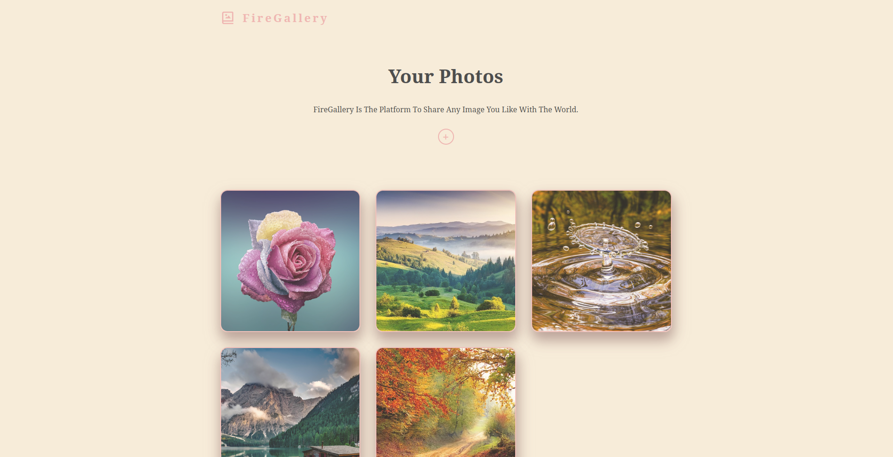

	<h1>Photo Gallery
	 
		
		
        
		 
	</h1>
	<h3> 👇 Check It Out 👇 </h3>

## 📝 Description
My Take on building a simple photo gallery app. 
-I made this app with react. 
-Used the Framer Motion librery for slight animations. 
-Used Firebase storage and Firestore to store the images and their information. 
-And styled the page with Css.

## 🛠️ Built with
 * CSS.
 * React.
 * Firebase.
 * Framer-Motion.

## Conclusion
I built this app mainly to familiarize myself with Firebase and cement my react and CSS skills.